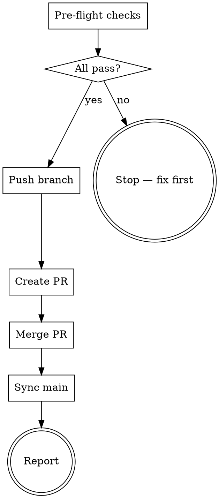

> **Kit variant: github ship target.** Installed when this project's interview
> answer (Q3 — "how does code reach your default branch?") resolves to GitHub.
> Pushes to a remote, opens a PR, merges it there. The **local** variant
> (`SKILL-local.md`) merges to main entirely on this machine, with no push and
> no PR — see that file's header for when it's the better fit. Only one of the
> two is ever installed under the name `GIT`.

> **Execution model:** This skill runs on the Orchestrator seat during the ship phase. No subagent dispatch needed. All operations are sequential shell commands.

# GIT — Push, PR, Merge, Sync

## Overview

Ship completed work: push the branch, create a pull request, merge it, and sync local main. This is the single command for "I'm done, ship it."

## When to Use

- **All tiers (T1, T2, T3):** Final step in every pipeline — push, PR, merge, sync
- When the user explicitly says `/GIT` or "ship it" or "merge it"
- After Definition of Done passes (T1) or audit is clean (T2/T3)
- **Never** invoke automatically — only when the user requests it

## Pre-flight Checks

Before doing anything, verify:

1. **Correct branch:** `git branch --show-current` — must be a `feature/*` branch, never `main`
2. **Clean state:** `git status` — no uncommitted changes (commit or stash first)
3. **Tests pass:** `{{TEST_CMD}}` — zero failures
4-6. **Lint / format / type (changed-file scoped):** run `{{LINT_CMD}}` and `{{TYPE_CMD}}` over this project's full source tree, then scope the pass/fail decision to files this branch changed.
   - No error in a file this branch changed → proceed. Pre-existing debt in UNCHANGED files is reported but does not block.
   - An error sits in a file this branch changed (whether pre-existing or new — touching a file makes ALL of its errors blocking) → stop and clean it up first.
   - If git can't determine the diff (detached HEAD, shallow clone, etc.), fail closed and enforce the full tree instead of guessing.
7. **Second-opinion-seat gate (module `22-second-opinion-seat`):**
   - Determine the ticket's tier (module `20-tier-system`). A plain **T1** (no `RISK_PREFIXES` diff, no gate evidence recorded for spec/plan) → this gate auto-passes; skip to the report.
   - For **T2 / T2-RISK / T3 / T3-RISK**, derive the REQUIRED PHASE SET from (routing profile, tier) — the profile's number is a COUNT of required phase-gates, each needing its own evidence; it is never passed as a per-phase `--threshold`:

     | Profile | T2 required phases | T3 required phases |
     |---|---|---|
     | PRO | `{spec}` | `{spec}` |
     | MAX5 | `{spec, audit}` | `{spec, audit}` |
     | MAX20 | `{spec, audit}` | `{spec, audit, plan}` |

     A `-RISK` tier suffix adds the NEXT phase in the sequence `[spec, audit, plan]` not already in the set, capped at all 3 phases (mirrors module 22's `-RISK` phase-set-bump rule) — e.g. PRO-RISK T2 → `{spec, audit}`; MAX20-RISK T3 stays `{spec, audit, plan}` (already at the cap).

     Check EACH phase in the required set at `--threshold 1` — one review is one piece of evidence for that phase:
     ```bash
     python3 .claude/hooks/check_gate_evidence.py --check-phase spec --threshold 1
     python3 .claude/hooks/check_gate_evidence.py --check-phase audit --threshold 1   # only if audit is in the required set
     python3 .claude/hooks/check_gate_evidence.py --check-phase plan --threshold 1    # only if plan is in the required set
     ```
     (`audit-fix` evidence counts as a valid substitute for `audit` — REVIEW's dual-writer convention.)
   - Any required phase short of its threshold → print the FAIL line, then ask the user: `"Second-opinion gate short on phase <phase>. Provide an override reason to proceed (or close the gap first):"`
     - Reason provided → append JSON to `.claude/state/gate-evidence/<branch-slug>/overrides.log`, proceed.
     - Blank / no reason → stop. Do not push.
   - **MAP-dossier-presence condition — only when this install's rigor profile is FULL (`map_mandatory: true`) and the tier is T2/T3 (or its `-RISK` variant):** read the standing brief's `**MAP-dossier:**` line. FAIL if the line is absent, the file it points to doesn't exist, or that file's terminal status line isn't literally `Status: CONVERGED`. This is a simple **file-presence-and-content check** (Read/Glob only) — this kit does NOT port a transcript-backed evidence-store mechanism some pattern sources use, only this dossier condition.
   - **Playbook-slots check — only when module `30-reasoning-playbooks` is installed:** run its slot-presence check. It is WARN-only (fail-open) — it never blocks the gate, it only prints a reminder.
   - **Missing standing brief on a branch that provably needs one** (a `RISK_PREFIXES` diff, OR gate evidence already recorded for spec/plan) → FAIL: write the standing brief, or use the override above.

Override log entry format:
```json
{"ts": "<iso8601>", "branch": "<slug>", "tier": "T2", "phase": "audit", "count": 0, "threshold": 1, "reason": "<user text>"}
```

If checks 1–6 fail, **stop and report**. Check 7 has its own override flow above.

## Process



### 1. Push Branch

```bash
git push -u origin $(git branch --show-current)
```

### 2. Create PR

> **No Claude / AI-assistant mentions in the PR text — no exceptions.** Before
> running `gh pr create`, strip every AI-tooling attribution from BOTH the
> title and the body: no "Claude", "Claude Code", "🤖 Generated with Claude
> Code" footer, no "Co-Authored-By: Claude ..." trailer, no "Anthropic", no
> "AI-generated" / "AI assistant" — nothing. This overrides any default
> PR-footer/trailer the calling tool would otherwise append; do not let it
> pass through. The PR title and body must read as an ordinary
> human-authored change description, indistinguishable from one a person
> wrote by hand. **Scope:** this governs only the PR title/body pushed to
> GitHub. Any Claude/AI co-author convention this project documents
> separately for **commit messages** is a different artifact and is
> untouched by this rule — do not conflate the two.

Use `gh pr create` with:
- **Title:** `type(scope): description [TICKET-ID]` — matching the commit convention. No AI-tooling mention of any kind.
- **Body:** Summary of changes, test plan, link to ticket. No footer, trailer, or byline naming Claude, Claude Code, Anthropic, or any AI assistant.
- **Base:** `main`

```bash
gh pr create --title "<title>" --body "$(cat <<'EOF'
## Summary
<1-3 bullet points of what changed>

## Test plan
- [ ] tests pass
- [ ] lint/format/type checks clean
- [ ] <any manual verification steps>

Closes #<issue-number>
EOF
)"
```

Note the template above ends at `Closes #<issue-number>` — there is no
"Generated with Claude Code" footer or "Co-Authored-By: Claude" trailer in
it, and none should ever be added back.

### 3. Merge PR

```bash
gh pr merge --squash --delete-branch
```

Use `--squash` to keep main history clean. `--delete-branch` removes the remote feature branch.

### 4. Sync Local Main

```bash
git checkout main
git pull origin main
```

Clean up the local feature branch if it still exists:
```bash
git branch -d <feature-branch>  # safe delete (only if merged)
```

### 5. Report

Output:
```
## Shipped

- **Branch:** feature/<name>
- **PR:** #<number> (<url>)
- **Merged:** squash into main
- **Local:** synced to main, feature branch deleted
```

## Rules

1. **Never push to main directly.** Always go through a PR.
2. **Never force push.** If push fails, investigate why.
3. **Never merge without passing pre-flight.** Tests and lint must be clean.
4. **Always squash merge.** Keeps main history readable.
5. **Always delete the remote branch after merge.** Keeps the repo clean.
6. **If PR creation fails** (e.g., no commits ahead of main), report the error — don't retry blindly.
7. **Never mention Claude or any AI assistant in the PR title or body.** No "Claude", "Claude Code", "🤖 Generated with Claude Code" footer, no "Co-Authored-By: Claude ..." trailer, no "Anthropic". Strip these before every `gh pr create` call, even if the calling tool's default behavior would otherwise add them. This rule covers the PR text only — it does not change any commit-message convention documented elsewhere for this project.
