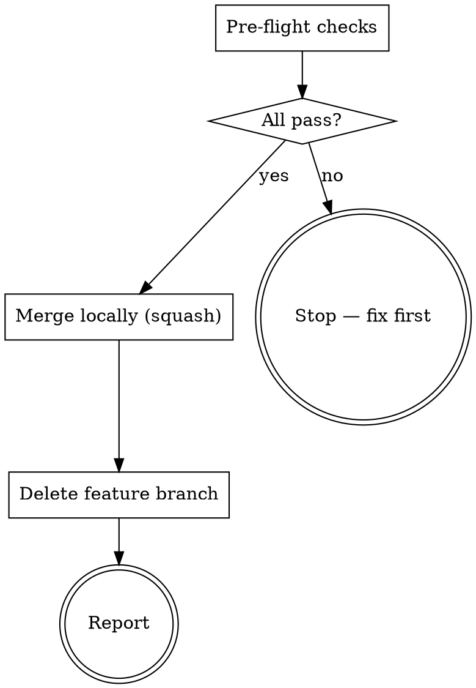

> **Kit variant: local ship target — an ADAPTATION, not a pure scrub.** Installed
> when this project's interview answer (Q3 — "how does code reach your default
> branch?") resolves to "locally, no GitHub remote." This variant has **no
> pattern-source counterpart**: the pattern this kit generalizes only ever ships
> through a GitHub remote (publish branch → PR → squash-merge). This file adapts
> that same pre-flight discipline and squash-merge outcome to a **fully local**
> merge — no branch-publishing command, no PR, no remote interaction of any kind.
> It exists for projects with no GitHub remote at all (a solo local repo, an
> air-gapped project, or a remote the member doesn't want this kit to touch). The
> **github** variant (`SKILL-github.md`) is the pure scrub of the pattern-source
> skill; only one of the two is ever installed under the name `GIT`.

> **Execution model:** This skill runs on the Orchestrator seat during the ship phase. No subagent dispatch needed. All operations are sequential shell commands, and none of them touch a remote.

# GIT — Merge and Clean Up (local-only)

## Overview

Ship completed work: merge the branch into the local trunk branch (squash, to keep history readable) and clean up the feature branch. This is the single command for "I'm done, ship it" on a project with no GitHub remote in the loop.

## When to Use

- **All tiers (T1, T2, T3):** Final step in every pipeline — merge, clean up
- When the user explicitly says `/GIT` or "ship it" or "merge it"
- After Definition of Done passes (T1) or audit is clean (T2/T3)
- **Never** invoke automatically — only when the user requests it

## Pre-flight Checks

Before doing anything, verify:

1. **Correct branch:** `git branch --show-current` — must be a `feature/*` branch, never `<trunk>` (resolved by section 1's trunk recipe)
2. **Clean state:** `git status` — no uncommitted changes (commit or stash first)
3. **Tests pass:** `{{TEST_CMD}}` — zero failures
4-6. **Lint / format / type (changed-file scoped):** run `{{LINT_CMD}}` and `{{TYPE_CMD}}` over this project's full source tree, then scope the pass/fail decision to files this branch changed.
   - No error in a file this branch changed → proceed. Pre-existing debt in UNCHANGED files is reported but does not block.
   - An error sits in a file this branch changed (whether pre-existing or new — touching a file makes ALL of its errors blocking) → stop and clean it up first.
   - If git can't determine the diff (detached HEAD, shallow clone, etc.), fail closed and enforce the full tree instead of guessing.
7. **Second-opinion-seat gate (module `22-second-opinion-seat`):**
   - Determine the ticket's tier (module `20-tier-system`). A plain **T1** (no `RISK_PREFIXES` diff, no gate evidence recorded for spec/plan) → this gate auto-passes; skip to the report.
   - For **T2 / T2-RISK / T3 / T3-RISK**, derive the REQUIRED PHASE SET from (routing profile, tier) — the profile's number is a COUNT of required phase-gates, each needing its own evidence; it is never passed as a per-phase `--threshold`:

     | Profile | T2 required phases | T3 required phases |
     |---|---|---|
     | PRO | `{spec}` | `{spec}` |
     | MAX5 | `{spec, audit}` | `{spec, audit}` |
     | MAX20 | `{spec, audit}` | `{spec, audit, plan}` |

     A `-RISK` tier suffix adds the NEXT phase in the sequence `[spec, audit, plan]` not already in the set, capped at all 3 phases (mirrors module 22's `-RISK` phase-set-bump rule) — e.g. PRO-RISK T2 → `{spec, audit}`; MAX20-RISK T3 stays `{spec, audit, plan}` (already at the cap).

     Check EACH phase in the required set at `--threshold 1` — one review is one piece of evidence for that phase:
     ```bash
     python3 .claude/hooks/check_gate_evidence.py --check-phase spec --threshold 1
     python3 .claude/hooks/check_gate_evidence.py --check-phase audit --threshold 1   # only if audit is in the required set
     python3 .claude/hooks/check_gate_evidence.py --check-phase plan --threshold 1    # only if plan is in the required set
     ```
     (`audit-fix` evidence counts as a valid substitute for `audit`.)
   - Any required phase short of its threshold → print the FAIL line, then ask the user: `"Second-opinion gate short on phase <phase>. Provide an override reason to proceed (or close the gap first):"`
     - Reason provided → append JSON to `.claude/state/gate-evidence/<branch-slug>/overrides.log`, proceed.
     - Blank / no reason → stop. Do not merge.
   - **MAP-dossier-presence condition — only when this install's rigor profile is FULL (`map_mandatory: true`) and the tier is T2/T3 (or its `-RISK` variant):** read the standing brief's `**MAP-dossier:**` line. FAIL if the line is absent, the file it points to doesn't exist, or that file's terminal status line isn't literally `Status: CONVERGED`.
   - **Playbook-slots check — only when module `30-reasoning-playbooks` is installed:** run its slot-presence check. It is WARN-only (fail-open) — it never blocks the gate, it only prints a reminder.
   - **Missing standing brief on a branch that provably needs one** (a `RISK_PREFIXES` diff, OR gate evidence already recorded for spec/plan) → FAIL: write the standing brief, or use the override above.

Override log entry format:
```json
{"ts": "<iso8601>", "branch": "<slug>", "tier": "T2", "phase": "audit", "count": 0, "threshold": 1, "reason": "<user text>"}
```

If checks 1–6 fail, **stop and report**. Check 7 has its own override flow above.

## Process



### 1. Merge Locally (squash)

No remote interaction — this assumes the local trunk branch is already this
project's source of truth (no `git fetch`/`git pull` step, unlike a
remote-tracked workflow).

Resolve the trunk branch first — a remote-less repo has no `origin/HEAD` to
consult, so check what exists (no pipes needed; run each until one succeeds):

- `git show-ref --verify --quiet refs/heads/main` → trunk is `main`
- else `git show-ref --verify --quiet refs/heads/master` → trunk is `master`
- else use the name from `git config init.defaultBranch` (defaults to `main`)

```bash
git checkout <trunk>
git merge --squash <feature-branch>
git commit -m "<title> [TICKET-ID]"
```

`--squash` stages the feature branch's changes without creating a merge commit or carrying its commit history — `git commit` then makes one clean commit on the trunk, matching the github variant's squash-merge outcome without a PR.

### 2. Delete the Feature Branch

```bash
git branch -d <feature-branch>  # safe delete (only if merged)
```

> After a **squash** merge, `git branch -d` refuses — the squash commit rewrites the
> changes onto the trunk, so the branch tip is not an ancestor. Verify the squash
> commit landed (`git log --oneline -1` on the trunk), then delete with `git branch -D`.

### 3. Report

Output:
```
## Shipped (local)

- **Branch:** feature/<name> — merged locally, no remote interaction
- **Merged:** squash into the trunk branch (local commit, no PR)
- **Local:** on the trunk branch, feature branch deleted
```

## Rules

1. **Never merge without passing pre-flight.** Tests and lint must be clean.
2. **Always squash merge.** Keeps trunk history readable, same as the github variant.
3. **No branch-publishing command, no PR, no remote command of any kind.** This variant exists precisely because this project has no GitHub remote in its ship path — reintroducing a remote call here defeats the point; if this project later adds a GitHub remote, switch to the github variant instead of patching remote calls into this one.
4. **Always delete the local feature branch after merge.** Keeps the repo clean.
5. **If the squash-merge conflicts,** report the conflict and stop — don't auto-resolve.
