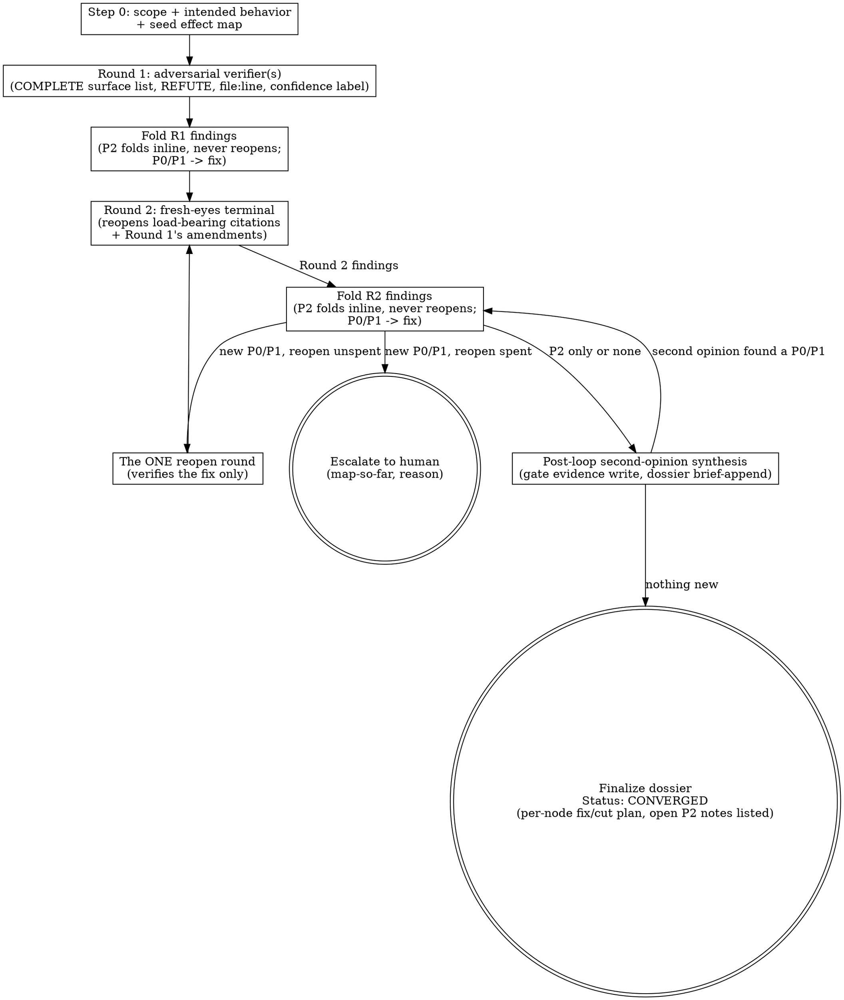

# MAP — Effect-Chain Mapping Loop (adversarial, guarded convergence)

> MAP was previously named VERIFY. `/VERIFY` still triggers this skill, for
> continuity with anyone used to the older name. Same machinery; the framing is
> generalized from "fault tree of a bug" to "the complete chain of effects of any
> finding/assumption about the system."

## Overview

A finding or assumption about how the system behaves ("X causes Y", "this column
stores values in a specific unit", "this gate blocks Z", "adding this constraint
is safe") is the visible tip of a **chain of effects**. X has that effect
*because of* A; A holds *because of* B and C; each link touches other state,
callers, and consumers that may themselves be wrong or surprising. This skill
maps that whole chain and adversarially verifies every link — the goal is **a
complete, correct map of how the effect propagates through the system and the
code, finding ALL connected surprises (rotten links to fix/cut, and load-bearing
dependencies to confirm) — not a yes/no on whether one finding is true.**

Within the fixed round budget (see Convergence, below), branching is still the
product, not scope-creep: a round that surfaces a new, genuinely connected
effect is the loop working, not the loop running long. The budget — not the
map's size — decides when the loop ends.

This skill is the mechanism behind this project's "always run a verification
loop before relying on a load-bearing finding" convention (module `00-core`,
if this install's CLAUDE.md documents it that way). Its convergence criterion is
authoritative.

## Convergence — budgeted

The loop runs a FIXED budget: Step 0 (seed + intended behavior) → Round 1
(adversarial; the dispatch hands the verifier the COMPLETE surface list —
every file, interface, and guard the change touches — so completeness is
enumerated once, not discovered one node per round) → Round 2 (terminal
fresh-eyes: a fresh-context verifier reopens the load-bearing citations and
Round 1's amendments).

**Finding disposition:**
- P2 / cosmetic / style / doc-polish: fix inline, record in the dossier, do
  NOT reopen the loop. Open P2 notes never block convergence.
- P0/P1 (wrong behavior, failing gate, false load-bearing claim): fix, then
  ONE reopen round verifies the fix. A P0/P1 surfacing AFTER the reopen round
  → STOP and escalate to the human with the map-so-far. Never run a fourth
  verification round on your own judgment. (Oscillation — the same node
  re-litigated with no new evidence — is grounds to escalate EARLY, before
  the budget is spent.)

**Terminal state:** `Status: CONVERGED` when the budget completes with all
P0/P1 resolved (open P2 notes listed, not blockers). If escalated:
`Status: OPEN — escalated <reason>` — the ship gate stays closed until the
human decides.

**The trade** (deliberate, owner-set): the old unbounded zero-new-nodes law
bought late cosmetic catches at 1-2 verifier dispatches each. Those now flow
to the review/AUDIT loop instead — which remains mandatory and is this
budget's safety net.

## When to use

Auto-trigger (do NOT wait for an owner prompt):

- Any T2/T3 audit BEFORE shipping; any FIX ticket scope BEFORE it is written
- Any "verify" / "confirm" / "map" / "deep dive" / "check" / "analyse" owner instruction
- The synthesis step of `superpowers:systematic-debugging`
- Any finding or assumption you are about to **act on, build on, present as fact,
  or write into a ticket/report/dossier** — that itself fires the loop; map it
  before you rely on it (this is the broadest trigger and the most often skipped)

If a finding is load-bearing and this loop's budget has not yet completed
(Round 2 terminal, or the reopen round if one was spent), it is
**unverified — say so**; do not present it as fact.

## The two-round loop (Round 2 re-examines Round 1)

The loop is exactly two rounds, plus at most one reopen:

- **Round 1 takes Step 0's seed map and the complete surface list as input.**
  It does NOT re-derive from scratch — Step 0 already established intended
  behavior and the first-pass map.
- **Round 1 adversarially attacks that input** — it tries to REFUTE every node
  and enumerate the complete surface handed to it (see Coverage discipline,
  below). REFUTATION is the method; MAPPING is the goal.
- **Round 2 (fresh-eyes) takes Round 1's updated map as input** and
  independently reopens the load-bearing citations and Round 1's amendments —
  a genuinely fresh context, not a continuation of Round 1's own reasoning.
- **End of Round 2 — exactly two outcomes:**
  1. **Nothing outstanding** — no unresolved P0/P1, no unfolded finding. →
     converge (go to post-loop second-opinion synthesis, then finalize).
  2. **A P0/P1 surfaced** — fix it, then spend the single reopen round
     verifying the fix. If the reopen has already been spent, escalate
     instead of running a further round.

Each round's perspective is wider than the last: Round 2 inherits everything
Round 1 confirmed and independently re-examines what Round 1 might have
missed. By design the budget is fixed at two rounds plus one reopen — see
Convergence — budgeted, above, for the exact terminal conditions.

## Coverage discipline — complete surface, up front (efficiency)

Round 1 receives the COMPLETE surface list at dispatch time — every file,
interface, and guard the change touches — so the full breadth of the change
is enumerated once, in Round 1, rather than discovered piecemeal across
rounds:

- The Step 0 seed map (functions/state/rows the finding directly touches) is
  the starting surface; the orchestrator adds any file/interface/guard the
  change touches that Step 0 didn't already capture, before dispatching
  Round 1.
- A node enters the map ONLY via a **causal or data-flow edge** to an
  existing node ("X is rotten/true *because of* Y", "Y feeds X", "X reads/
  writes the state Y produces"). This keeps the map on the actual
  effect-chain instead of wandering into unrelated subsystems, even though
  the whole surface is handed over up front.
- Round 2 does not re-enumerate the surface; it re-examines Round 1's
  conclusions with fresh eyes. This is cheaper than repeated re-discovery
  (the full breadth is named once) and more complete (nothing is skipped by
  surfacing too late for the budget to cover it).

A node with NO causal/data-flow edge to the map is out of scope — note it as
a separate investigation; do not silently drop it and do not chase it here.

## Step 0 — Scope & intended-behavior overview (before any adversarial round)

You cannot tell a rotten link from a healthy one without knowing what the code is
*supposed* to do. Dispatch the Audit reviewer seat (a fresh-context subagent on
that seat's model, per the active routing profile — MAP reuses the same
strongest-available adversarial code-reading seat that REVIEW uses; see
`profiles/routing-*.md`) to produce:

- The intended behavior / contract of the subsystem containing the root finding
- The root finding stated as a claim, and its immediate neighborhood (the
  functions/files/state it directly touches and depends on)
- The seed map: `root → first-ring suspected causes/effects`, each a claim
- A **blindspot-class pass** on the seed (makes each round capture more without
  changing convergence semantics): for every seed node, screen the five recurring
  blindspot classes and seed a node wherever one applies —
  1. **coefficient-vs-intuition** — is the claim traced to a fitted coefficient / `file:line`, or to an output-pattern story? (e.g. a regression coefficient that quietly collapsed to a degenerate constant, read as "no effect" without checking why the fit degenerated);
  2. **staleness** — does any cited prior result's config AND snapshot-date match current state? (a config diff is a refutation, not a footnote);
  3. **snapshot-vs-permanent** — is a "never/always/can't/only" claim really a *static read of a time-varying quantity*? Name the dynamics;
  4. **already-implemented** — might the code already do this? grep before treating it as new work (e.g. a proposed step the code already applies elsewhere under a different name);
  5. **inferred-dependency** — a code path is not an inherent dependency (e.g. treating "this ran against staging" as proof it also holds for production, when the two environments diverge).

Write this as the initial dossier + Effect Map at
`docs/analyses/<investigation-slug>/map-dossier.md`. Only then begin adversarial
rounds.

## The Effect Map (the artifact that decides convergence)

Maintain a tree/graph, refreshed every round, in the dossier:

```
ROOT: <the finding/assumption stated as a claim>
├─ A: <cause/effect of ROOT>     [rotten:fix | rotten:cut | Verified-correct | unresolved]  ev: file:line / query
│  ├─ B: <cause/effect of A>     [...]
│  └─ C: <cause/effect of A>     [...]
└─ D: <other cause/effect of ROOT>  [...]
```

- Every node is a claim with a confidence label (Verified / Estimated / Assumed / Unknown) and file:line/query evidence.
- Edges are causal/dependency/data-flow ("X because of Y", "Y feeds X").
- Node states: `Verified-correct` (proven, positive evidence), `rotten:fix`
  (defect, fix it), `rotten:cut` (defect, remove/replace), `unresolved` (not yet
  proven either way — remains open for the next round, or the reopen, to resolve).
- A finding that is connected but in a *sibling* subsystem is still a node — add
  it, label it, decide fix/cut/defer. It is a branch, not scope-creep.
- **The `ev:` slot MUST be a primary source (circularity-rejection convention).** A `Verified-correct` node's `ev:` is a `file:line`, a query, a primary doc, or a raw data / independent-subagent-return artifact — NEVER a prior `map-dossier.md` (that is a prior *verification conclusion*, not a primary source; citing it is circular — the loop grading its own homework). Put dossier lineage / "see also" / predecessor references in a `[[link]]`, a `**Prior art:**` / `**MAP-dossier:**` header field, or prose — never the `ev:` slot. If this install's guards module (`23-guards`) is present, a MAP-dossier write whose structured `[Verified-correct` node's `ev:` cites the canonical `map-dossier.md` filename is flagged by a non-blocking WARN automatically; treat the underlying rule as binding regardless of whether that automated check is installed.

## The round record (mechanical bookkeeping, orchestrator-determined, written down)

Each round, after reading the verifier output, the orchestrator writes a
**Round Record**:

```
## Round <N> Record
- Findings this round (node, claim, evidence, confidence label): <list, or NONE>
- Disposition per finding:
  - P2 / cosmetic → folded inline (listed here; does NOT reopen the loop)
  - P0/P1 → fixed; reopen: <spent | not needed yet | ALREADY SPENT — ESCALATE>
- Inter-verifier contradictions:     <list, or NONE>
- Orchestrator self-adjudications:   <list, or NONE>  (each re-enters as an unresolved node)
- Unresolved nodes remaining:        <count + list>
- Non-`Verified` load-bearing nodes: <list, or NONE>
Verifier self-report: <quote "Restart? Y/N"> (ADVISORY — not the decision)
Round resolved? = YES only if every finding above is either a folded P2 or a
P0/P1 that is fixed and (if it needed the reopen) reopen-verified, AND zero
unresolved load-bearing nodes remain.
```

**Observe-only blindspot tally (only if this install's guards module, `23-guards`, is present):** when writing the Round 1 record, append each Round-1 finding's blindspot class to this install's confidence-label-miss log (via the guards module's claim classifier). This is **observe-only** — it measures which blindspot classes recur; it MUST NOT steer a finding's disposition or the convergence decision. Skip cleanly if module `23-guards` isn't installed.

Absence of refutation ≠ `Verified`. A node is only `Verified-correct` with positive
file:line/query evidence; otherwise it stays `unresolved`.

**The verifier's "Restart? NO" can NEVER resolve a round on its own.** A round is
resolved ONLY when the orchestrator has positively enumerated the verifier's
*body* (every finding, mechanism, child cause it named) into the Round Record
and that enumeration contains no unfolded P0/P1. If you have not written out
the body's findings, the round is NOT resolved — default to unresolved, never
to resolved. Reading the verdict instead of the body ships a wrong map; the
verdict line exists only to be quoted and then ignored as a decision input.

**"Connected" is defined by a causal/dependency/data-flow edge, not by proximity.**
A fault or effect in a *different file, module, or subsystem* is connected if it
lies on the chain from the root — and is then a branch to map, never grounds to
declare oscillation. You may NOT down-rank a causally-linked node to "tangential /
different subsystem" to avoid disposing of it honestly.

## Oscillation guard — escalate early, don't spend the reopen on it

Two rounds is enough to expect closure on a well-scoped effect chain. Watch for
the one failure mode that isn't just "found more work":

- **New finding** — Round 1 or Round 2 surfaces a genuinely new,
  causally-connected node (new evidence, a child cause named for the first
  time). This is the loop working as designed; classify it P0/P1/P2 and
  follow the finding-disposition rule above.
- **Oscillation** — a node already examined is re-litigated with NO new
  evidence, OR two verifiers contradict on the same node across rounds with
  neither producing new evidence that resolves it, OR the map neither grew
  nor resolved. → THIS is the genuine "architecture/question is wrong"
  signal — escalate to the human immediately with the map-so-far and the
  stuck node(s), rather than spending the single reopen round chasing it.

A connected effect in a different file, module, or subsystem is still a
branch on the chain — it is never grounds to wave a finding off as "scope too
broad" or "tangential" to avoid disposing of it.

## Process



## Steps

1. **Step 0 overview** (above). Seed the dossier + Effect Map.
2. **Dispatch the adversarial verifier(s).** Use the Audit reviewer seat for
   ALL adversarial verifiers and code-reading roles (per the active routing
   profile — this is the strongest available seat for adversarial
   code-reading, same seat REVIEW uses), the `general-purpose` agent for
   SSH/DB/log forensics if applicable to this project, Retrieval-seat agents
   for trivial git/DB one-liners only. For Round 1, hand the verifier the
   COMPLETE surface list (every file, interface, and guard the change
   touches) plus Step 0's seed map; for Round 2 (fresh-eyes) or the reopen
   round, hand the verifier the current map and the specific node(s) to
   re-examine. Instruct EXPLICITLY:
   "[MAP-VERIFIER] REFUTE these node(s), do not confirm. You receive the
   COMPLETE surface list — enumerate and refute ALL of it this round. Every
   behavioral claim needs a file:line/query + confidence label. Trace *why*
   each node is rotten/true — name its child causes/effects as new candidate
   nodes. State INDETERMINATE where evidence is absent. For EACH node, screen
   the five blindspot classes and raise a new candidate node for any that
   apply: coefficient-vs-intuition (claim traced to a fitted coefficient/
   file:line, not an output-pattern story); staleness (cited result's config +
   snapshot-date matches current state); snapshot-vs-permanent (a
   'never/always/can't' claim that is a static read of a time-varying
   quantity — name the dynamics); already-implemented (grep before treating
   as new); inferred-dependency (a code path is not an inherent dependency).
   Do NOT call the second-opinion seat yourself. End 'Restart? YES/NO' + list
   every new finding/refutation." Parallel verifiers per branch cluster;
   cross-check them for mutual contradiction. (The `[MAP-VERIFIER]` prefix
   bypasses module `20-tier-system`'s standing-brief gate —
   `require_standing_brief` in `task_checks.py` — so a MAP loop can run on a
   brief-less investigation branch; the check matches the prefix
   case-insensitively.)
3. **Update the map + write the Round Record** (orchestrator, by auditing verifier
   CONTENT — the verifier's YES/NO is advisory only). Add new nodes, relabel
   resolved/refuted/inverted ones, downgrade any non-evidenced node to
   `unresolved` (never silently `Verified`).
4. **Disposition.** Fold every P2/cosmetic finding inline (record it, never
   reopens). For each P0/P1: fixed and reopen-verified (or no reopen needed
   yet) → resolved; fixed but the reopen is unspent → spend it now; a P0/P1
   found with the reopen already spent → escalate. There is "fold inline",
   "spend the reopen", or "escalate" — never "one more round" as a guess.
5. **Orchestrator adjudication never resolves a P0/P1 on its own.** You may
   fold a P2 inline directly — that's within the orchestrator's authority.
   But you may NOT self-clear a P0/P1: any conclusion you reach yourself
   about a P0/P1 is logged as an orch. self-adjudication = an `unresolved`
   node that the reopen round's adversarial verifier must independently
   confirm/refute. Trust but verify applies to YOU.
6. **Post-loop second-opinion synthesis** (only after Round 2 terminal, or
   the single reopen round, resolves every P0/P1): make the dossier durable;
   record gate evidence —
   `python3 .claude/hooks/check_gate_evidence.py --write-evidence audit`
   (REVIEW is the canonical `audit` writer on a normal ticket's clean Step-6
   report; MAP writes `audit` when MAP is the convergence engine. Both
   idempotent — this project's ship gate accepts either). Then dispatch the
   second-opinion seat. **If it surfaces a new P0/P1 → spend the reopen if
   unspent, else escalate** (back to step 3). Budget: ≤1 mid-loop check if
   genuinely stuck on oscillation, +1 post-loop synthesis.
   After writing the dossier, if a standing brief exists at
   `docs/superpowers/briefs/<branch-slug>.md`, append
   `**MAP-dossier:** <this dossier's path>` to it **iff `**MAP-dossier:**` is
   absent** (do NOT overwrite an investigator-set value — the investigator owns the
   declaration); on missing brief or I/O error, log and continue (no raise). This
   rides the in-flow MAP run so the ship-gate field is set without a separate
   manual step.

7. **Finalize the dossier.** Status line, literal:
   - `Status: CONVERGED` when the budget completes (Round 1, Round 2, and the
     reopen if it was spent) with every P0/P1 resolved — open P2 notes are
     listed, not blockers.
   - `Status: OPEN — escalated <reason>` if a P0/P1 surfaced with the reopen
     already spent — never bare "CONVERGED" with an unresolved P0/P1.
   - Dossier contains: the Effect Map, per-round record trace, per-node confidence
     label + file:line, and a fix/cut plan per rotten node for implementers.

## Red flags — STOP, you are rationalizing

| Thought | Reality |
|---|---|
| "This is P2 — I'll quietly skip mentioning it." | Fold P2s inline AND record them in the dossier. Silent omission is not folding. |
| "I already used the reopen; let me just fix this one more thing myself." | A P0/P1 after the reopen is spent is an ESCALATE, not a self-fix. Stop and hand it to the human. |
| "These new findings are scope-creep / a different subsystem." | A connected effect is a branch, not creep. Add it, label fix/cut/defer, and disposition it by severity. |
| "The verifier said Restart? NO." | The verdict CANNOT resolve a round. You must have enumerated the verifier's body into the Round Record and found it empty of P0/P1s. |
| "This connected effect is really a different subsystem / tangential." | Connection = a causal/data-flow edge, not file proximity. On the chain ⇒ it is a branch. |
| "I'll confirm this node looks right and move on." | The method is REFUTATION. Round 2 attacks Round 1's map; a confirmatory pass ships a wrong map (a confirmatory pass once wrongly labeled a healthy safeguard as broken; the next, adversarial pass caught the mislabel and inverted it). |
| "I can see which side is right — I'll decide it myself." | Self-adjudication = an unresolved node for the reopen round, not a resolution. |
| "The second opinion only refined it; fold it in." | A second-opinion P0/P1 spends the reopen if unspent, else escalates. No silent folds. |
| "Root cause is solid, call it CONVERGED." | An unresolved P0/P1 ⇒ not CONVERGED; escalate instead. Open P2 notes are fine — list them. |
| "Skip Step 0, I know what the code should do." | Without the intended-behavior reference you cannot label a node rotten vs correct. Do Step 0. |
| "Let me spend a third round on my own judgment." | The budget is fixed: Round 1, Round 2, at most one reopen. Anything past that needs an escalation, not a private decision. |

## Rules

1. Goal = the COMPLETE map of the effect-chain (all connected rotten links to fix/cut + load-bearing dependencies confirmed), not a single-claim yes/no.
2. Step 0 scope/intended-behavior overview precedes every adversarial round.
3. Round 1 adversarially examines Step 0's seed map against the complete surface list; Round 2 (fresh-eyes) adversarially re-examines Round 1's map. REFUTATION is the method.
4. Convergence = the fixed budget (Round 1, Round 2, one reopen if spent) completes with every P0/P1 resolved. Not an open-ended search, not a verifier verdict, not your judgment.
5. Fold P2/cosmetic findings inline; they never reopen the loop. A P0/P1 spends the single reopen round; oscillation (re-litigation / unresolved contradiction with no new evidence) escalates EARLY, before the reopen is spent.
6. Verifiers REFUTE, never confirm; file:line + confidence label on every node every round; they must name child causes/effects of each node.
7. Inter-verifier contradiction and orchestrator self-adjudication on a P0/P1 are both `unresolved` nodes — not yet resolved.
8. A post-loop second-opinion P0/P1 spends the reopen if unspent, else escalates.
9. "CONVERGED" reserved for every P0/P1 resolved + second-opinion clear of new P0/P1s. Otherwise `Status: OPEN — escalated <reason>`.
10. Persist/refresh the Effect Map + Round Record trace in the dossier every round (`map-dossier.md`).
11. Never present an unconverged map as fact in chat, ticket, report, or dossier.
