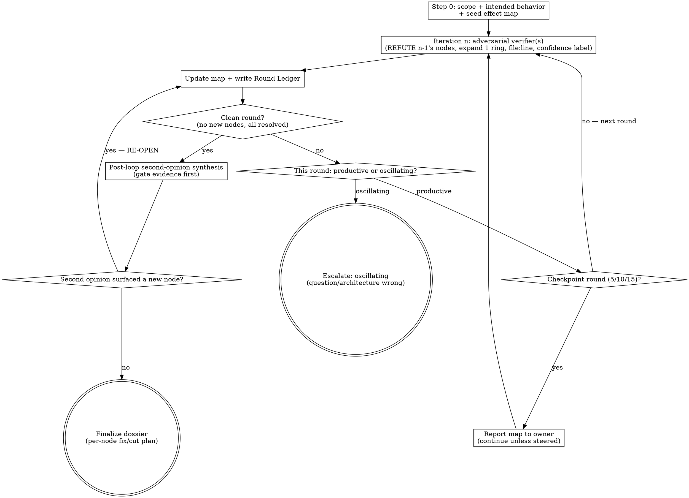

# MAP — Effect-Chain Mapping Loop (adversarial, guarded convergence)

> MAP was previously named VERIFY. `/VERIFY` still triggers this skill, for
> continuity with anyone used to the older name. Same machinery; the framing is
> generalized from "fault tree of a bug" to "the complete chain of effects of any
> finding/assumption about the system."

## Overview

A finding or assumption about how the system behaves ("X causes Y", "this column
stores values in a specific unit", "this gate blocks Z", "adding this constraint
is safe") is the visible tip of a **chain of effects**. X has that effect
*because of* A; A holds *because of* B and C; each link touches other state,
callers, and consumers that may themselves be wrong or surprising. This skill
maps that whole chain and adversarially verifies every link — the goal is **a
complete, correct map of how the effect propagates through the system and the
code, finding ALL connected surprises (rotten links to fix/cut, and load-bearing
dependencies to confirm) — not a yes/no on whether one finding is true.**

Branching is the product, not scope-creep. A round that surfaces new genuinely
connected effects is the loop *working*. The loop ends when the map stops growing
and every node is resolved — never on a round count.

This skill is the mechanism behind this project's "always run a verification
loop before relying on a load-bearing finding" convention (module `00-core`,
if this install's CLAUDE.md documents it that way). Its convergence criterion is
authoritative.

## Core principle

> Terminate when, and only when, a FULL round adds ZERO new nodes to the effect
> map AND every node is resolved (`Verified-correct` or `rotten` with a fix/cut
> decision). Nothing else terminates it — not your judgment, not a verifier's
> verdict, not a round count, not "this is obviously right."

## When to use

Auto-trigger (do NOT wait for an owner prompt):

- Any T2/T3 audit BEFORE shipping; any FIX ticket scope BEFORE it is written
- Any "verify" / "confirm" / "map" / "deep dive" / "check" / "analyse" owner instruction
- The synthesis step of `superpowers:systematic-debugging`
- Any finding or assumption you are about to **act on, build on, present as fact,
  or write into a ticket/report/dossier** — that itself fires the loop; map it
  before you rely on it (this is the broadest trigger and the most often skipped)

If a finding is load-bearing and this loop has not reached a clean round, it is
**unverified — say so**; do not present it as fact.

## The rolling-perspective loop (iteration n re-examines n−1)

The loop is a sequence of iterations over an evolving understanding:

- **Iteration n takes as input the map + assumptions formed at the end of n−1**
  (iteration 1's input is Step 0's seed map). It does NOT re-derive from scratch.
- **Iteration n adversarially attacks that input** — it tries to REFUTE each
  not-yet-`Verified-correct` node and to expand the frontier one ring outward
  (see Expansion discipline). REFUTATION is the method; MAPPING is the goal.
- **End of iteration n — exactly two outcomes:**
  1. **Nothing new** — no node added, no node refuted/relabeled, no contradiction,
     no unresolved node left. The map from n−1 is proven. → **converge** (go to
     post-loop second-opinion synthesis, then finalize).
  2. **Something new** — a node was added, OR a prior assumption was refuted/
     narrowed/inverted, OR a contradiction surfaced. → **update the map and the
     assumptions**, and feed that updated understanding into iteration n+1. The
     loop re-runs against the new perspective.

So each iteration's perspective is wider than the last: it inherits everything
n−1 confirmed and pushes into what n−1 did not yet see. By design this continues
indefinitely; the ONLY stop is a fully-clean round (outcome 1). The guards below
(oscillation escape, on-chain scope test) exist so that "indefinitely" terminates
rather than diverges — they never stop a productively-growing map early.

## Expansion discipline — vicinity → global, along confirmed edges (efficiency)

Do NOT global-fan-out on round 1. Map breadth-first **one ring outward from
resolved nodes**:

- Round 1 covers the finding's immediate neighborhood (the functions/state/rows it
  directly touches). Each later round expands only to the *neighbors of nodes that
  are now resolved* — the next ring of callers, consumers, writers, and dependencies.
- A node enters the map ONLY via a **causal or data-flow edge** to an existing
  node ("X is rotten/true *because of* Y", "Y feeds X", "X reads/writes the state Y
  produces"). This keeps expansion on the actual effect-chain and is why the loop
  terminates instead of wandering into unrelated subsystems.
- This is cheaper than a global search (early rounds are small and focused) and
  more complete (you cannot skip a node by jumping too far past it).

A node with NO causal/data-flow edge to the map is out of scope — note it as a
separate investigation; do not silently drop it and do not chase it here.

## Step 0 — Scope & intended-behavior overview (before any adversarial round)

You cannot tell a rotten link from a healthy one without knowing what the code is
*supposed* to do. Dispatch the Audit reviewer seat (a fresh-context subagent on
that seat's model, per the active routing profile — MAP reuses the same
strongest-available adversarial code-reading seat that REVIEW uses; see
`profiles/routing-*.md`) to produce:

- The intended behavior / contract of the subsystem containing the root finding
- The root finding stated as a claim, and its immediate neighborhood (the
  functions/files/state it directly touches and depends on)
- The seed map: `root → first-ring suspected causes/effects`, each a claim
- A **blindspot-class pass** on the seed (makes each round capture more without
  changing convergence semantics): for every seed node, screen the five recurring
  blindspot classes and seed a node wherever one applies —
  1. **coefficient-vs-intuition** — is the claim traced to a fitted coefficient / `file:line`, or to an output-pattern story? (e.g. a regression coefficient that quietly collapsed to a degenerate constant, read as "no effect" without checking why the fit degenerated);
  2. **staleness** — does any cited prior result's config AND snapshot-date match current state? (a config diff is a refutation, not a footnote);
  3. **snapshot-vs-permanent** — is a "never/always/can't/only" claim really a *static read of a time-varying quantity*? Name the dynamics;
  4. **already-implemented** — might the code already do this? grep before treating it as new work (e.g. a proposed step the code already applies elsewhere under a different name);
  5. **inferred-dependency** — a code path is not an inherent dependency (e.g. treating "this ran against staging" as proof it also holds for production, when the two environments diverge).

Write this as the initial dossier + Effect Map at
`docs/analyses/<investigation-slug>/map-dossier.md`. Only then begin adversarial
rounds.

## The Effect Map (the artifact that decides convergence)

Maintain a tree/graph, refreshed every round, in the dossier:

```
ROOT: <the finding/assumption stated as a claim>
├─ A: <cause/effect of ROOT>     [rotten:fix | rotten:cut | Verified-correct | unresolved]  ev: file:line / query
│  ├─ B: <cause/effect of A>     [...]
│  └─ C: <cause/effect of A>     [...]
└─ D: <other cause/effect of ROOT>  [...]
```

- Every node is a claim with a confidence label (Verified / Estimated / Assumed / Unknown) and file:line/query evidence.
- Edges are causal/dependency/data-flow ("X because of Y", "Y feeds X").
- Node states: `Verified-correct` (proven, positive evidence), `rotten:fix`
  (defect, fix it), `rotten:cut` (defect, remove/replace), `unresolved` (not yet
  proven either way — keeps the loop open).
- A finding that is connected but in a *sibling* subsystem is still a node — add
  it, label it, decide fix/cut/defer. It is a branch, not scope-creep.
- **The `ev:` slot MUST be a primary source (circularity-rejection convention).** A `Verified-correct` node's `ev:` is a `file:line`, a query, a primary doc, or a raw data / independent-subagent-return artifact — NEVER a prior `map-dossier.md` (that is a prior *verification conclusion*, not a primary source; citing it is circular — the loop grading its own homework). Put dossier lineage / "see also" / predecessor references in a `[[link]]`, a `**Prior art:**` / `**MAP-dossier:**` header field, or prose — never the `ev:` slot. If this install's guards module (`23-guards`) is present, a MAP-dossier write whose structured `[Verified-correct` node's `ev:` cites the canonical `map-dossier.md` filename is flagged by a non-blocking WARN automatically; treat the underlying rule as binding regardless of whether that automated check is installed.

## Convergence (mechanical — orchestrator-determined, written down)

Each round, after reading the verifier output, the orchestrator writes a
**Round Ledger**:

```
## Round <N> Ledger
- New nodes added this round:        <list, or NONE>
- Nodes refuted / relabeled / narrowed/inverted: <list, or NONE>
- Inter-verifier contradictions:     <list, or NONE>
- Orchestrator self-adjudications:   <list, or NONE>  (each re-enters as an unresolved node)
- Unresolved nodes remaining:        <count + list>
- Non-`Verified` load-bearing nodes: <list, or NONE>
Verifier self-report: <quote "Restart? Y/N"> (ADVISORY — not the decision)
Round CLEAN? = YES only if: zero new nodes AND zero refutations/relabels/inversions
AND zero contradictions AND zero orch. self-adjudications AND zero unresolved nodes.
```

**Observe-only blindspot tally (only if this install's guards module, `23-guards`, is present):** when writing the Round-1 ledger, append each round-1 finding's blindspot class to this install's confidence-label-miss log (via the guards module's claim classifier). This is **observe-only** — it measures which blindspot classes recur; it MUST NOT steer the round count or the convergence decision. Skip cleanly if module `23-guards` isn't installed.

Absence of refutation ≠ `Verified`. A node is only `Verified-correct` with positive
file:line/query evidence; otherwise it stays `unresolved`.

**The verifier's "Restart? NO" can NEVER make a round clean.** A round is clean
ONLY when the orchestrator has positively enumerated the verifier's *body* (every
finding, mechanism, child cause it named) into the Round Ledger and that
enumeration is empty. If you have not written out the body's findings, the round
is NOT clean — default to not-clean, never to clean. Reading the verdict instead
of the body ships a wrong map; the verdict line exists only to be quoted and then
ignored as a decision input.

**"Connected" is defined by a causal/dependency/data-flow edge, not by proximity.**
A fault or effect in a *different file, module, or subsystem* is connected if it
lies on the chain from the root — and is then a branch to map, never grounds to
declare oscillation. You may NOT down-rank a causally-linked node to "tangential /
different subsystem" to end the loop early.

## Productive branching vs oscillation (the guard that makes "until-no-new" terminate)

A known failure mode: the loop hits a round count, sees a non-empty ledger of
*new connected effects*, and wrongly escalates as "scope too broad" — killing a
map that was still productively expanding.

Classify the round, every round:

- **Productive branching** — the round added NEW genuinely-connected nodes and/or
  resolved existing ones. The map is growing and/or filling in. → Success.
  Continue. Do NOT escalate, do NOT stop, regardless of round number.
- **Oscillation** — the round re-litigated an already-explored node with no new
  evidence, OR two verifiers contradict on the same node across ≥2 rounds with no
  new evidence resolving it, OR the map neither grew nor resolved. → THIS is the
  genuine "architecture/question is wrong" signal, and it is the ONLY thing that
  stops a non-clean loop short of convergence. Escalate to the owner with the
  map-so-far and the stuck node(s).

Round count is a **checkpoint cadence, not a stop**: at rounds 5, 10, 15, … pause
and report the current Effect Map to the owner ("N rounds, map has K nodes, P
rotten / Q unresolved, still productively branching — continuing unless you want
to steer"). Absent owner steer, a productively-branching loop continues. Only
oscillation forces a stop.

## Process



## Steps

1. **Step 0 overview** (above). Seed the dossier + Effect Map.
2. **Dispatch adversarial verifier(s) for iteration n.** Use the Audit reviewer
   seat for ALL adversarial verifiers and code-reading roles (per the active
   routing profile — this is the strongest available seat for adversarial
   code-reading, same seat REVIEW uses), the `general-purpose` agent for
   SSH/DB/log forensics if applicable to this project, Retrieval-seat agents for
   trivial git/DB one-liners only. Feed them n−1's map. Instruct EXPLICITLY:
   "[MAP-VERIFIER] REFUTE these node(s), do not confirm. Expand ONE ring outward along causal/
   data-flow edges from the resolved nodes. Every behavioral claim needs a
   file:line/query + confidence label. Trace *why* each node is rotten/true — name
   its child causes/effects as new candidate nodes. State INDETERMINATE where
   evidence is absent. For EACH node, screen the five blindspot classes and raise a
   new candidate node for any that apply: coefficient-vs-intuition (claim traced to
   a fitted coefficient/file:line, not an output-pattern story); staleness
   (cited result's config + snapshot-date matches current state); snapshot-vs-
   permanent (a 'never/always/can't' claim that is a static read of a time-varying
   quantity — name the dynamics); already-implemented (grep before treating as new);
   inferred-dependency (a code path is not an inherent dependency). Do NOT call
   the second-opinion seat yourself. End 'Restart? YES/NO' + list every
   new finding/refutation." Parallel verifiers per branch cluster; cross-check
   them for mutual contradiction. (The `[MAP-VERIFIER]` prefix bypasses module
   `20-tier-system`'s standing-brief gate — `require_standing_brief` in
   `task_checks.py` — so a MAP loop can run on a brief-less investigation branch;
   the check matches the prefix case-insensitively.)
3. **Update the map + write the Round Ledger** (orchestrator, by auditing verifier
   CONTENT — the verifier's YES/NO is advisory only). Add new nodes, relabel
   resolved/refuted/inverted ones, downgrade any non-evidenced node to
   `unresolved` (never silently `Verified`).
4. **Clean?** Zero new nodes AND every node resolved → go to post-loop
   second-opinion synthesis. Else classify productive vs oscillating and
   continue/checkpoint/escalate per above. There is "continue (productive)",
   "checkpoint-report (cadence)", or "escalate (oscillating)" — never "one more
   round" as a guess.
5. **Orchestrator adjudication never terminates a round.** You may read the
   canonical source to understand a node, but any conclusion you reach yourself is
   logged as an orch. self-adjudication = an `unresolved` node the NEXT round's
   adversarial verifier must independently confirm/refute. Trust but verify
   applies to YOU.
6. **Post-loop second-opinion synthesis** (only after a clean round): make the
   dossier durable; record gate evidence —
   `python3 .claude/hooks/check_gate_evidence.py --write-evidence audit`
   (REVIEW is the canonical `audit` writer on a normal ticket's clean Step-6
   report; MAP writes `audit` when MAP is the convergence engine. Both
   idempotent — this project's ship gate accepts either). Then dispatch the
   second-opinion seat. **If it surfaces a new node/refinement → the loop
   RE-OPENS** (back to step 3). Budget: ≤1 mid-loop check if genuinely stuck on
   oscillation, +1 post-loop synthesis.
   After writing the dossier, if a standing brief exists at
   `docs/superpowers/briefs/<branch-slug>.md`, append
   `**MAP-dossier:** <this dossier's path>` to it **iff `**MAP-dossier:**` is
   absent** (do NOT overwrite an investigator-set value — the investigator owns the
   declaration); on missing brief or I/O error, log and continue (no raise). This
   rides the in-flow MAP run so the ship-gate field is set without a separate
   manual step.

7. **Finalize the dossier.** Status line, literal:
   - `Status: CONVERGED` ONLY if the last round was clean, the second-opinion
     seat surfaced nothing new, and every node is `Verified-correct` or `rotten`
     with a fix/cut decision.
   - Otherwise `Status: <root> ROOT-CAUSE CONVERGED; OPEN: <unresolved nodes>` —
     never bare "CONVERGED" with open nodes.
   - Dossier contains: the Effect Map, per-round Ledger trace, per-node confidence
     label + file:line, and a fix/cut plan per rotten node for implementers.

## Red flags — STOP, you are rationalizing

| Thought | Reality |
|---|---|
| "Round 5, ledger not empty, escalate and stop." | Round count never stops the loop. Is it PRODUCTIVE (continue) or OSCILLATING (escalate)? New connected effects = productive = continue. |
| "These new findings are scope-creep / a different subsystem." | A connected effect is a branch, not creep. Add it, label fix/cut/defer. The point is the COMPLETE map. |
| "The verifier said Restart? NO." | The verdict CANNOT make a round clean. Clean requires you to have written the body's findings into the Ledger and found them empty. |
| "This connected effect is really a different subsystem / tangential." | Connection = a causal/data-flow edge, not file proximity. On the chain ⇒ it is a branch. |
| "I'll confirm this node looks right and move on." | The method is REFUTATION. n re-examines n−1 by attacking it. A confirmatory pass ships a wrong map (a confirmatory round once wrongly labeled a healthy safeguard as broken; the next, adversarial round caught the mislabel and inverted it). |
| "I can see which side is right — I'll decide it myself." | Self-adjudication = an unresolved node for the next round, not a resolution. |
| "The second opinion only refined it; fold it in." | A post-loop second-opinion node RE-OPENS the loop. No silent folds. |
| "Root cause is solid, call it CONVERGED." | Open/unresolved nodes ⇒ not CONVERGED. Enumerate them in the status. |
| "Map keeps growing, the question must be wrong." | Growing ≠ wrong. Only OSCILLATION (re-litigating a node, no new evidence) means the question is wrong. |
| "Skip Step 0, I know what the code should do." | Without the intended-behavior reference you cannot label a node rotten vs correct. Do Step 0. |
| "Let me map the whole system at once." | No — expand ONE ring outward along confirmed edges. Global fan-out is slower and skips nodes. |

## Rules

1. Goal = the COMPLETE map of the effect-chain (all connected rotten links to fix/cut + load-bearing dependencies confirmed), not a single-claim yes/no.
2. Step 0 scope/intended-behavior overview precedes every adversarial round.
3. Iteration n adversarially re-examines n−1's map and expands one ring outward along causal/data-flow edges. REFUTATION is the method.
4. Convergence = a full round adds zero new nodes AND every node resolved. Not a round count, not a verifier verdict, not your judgment.
5. Productive branching → continue. Oscillation (re-litigation / unresolved contradiction with no new evidence) → escalate. Rounds 5/10/15 = checkpoint-report cadence, not a stop.
6. Verifiers REFUTE, never confirm; file:line + confidence label on every node every round; they must name child causes/effects of each node.
7. Inter-verifier contradiction and orchestrator self-adjudication are both `unresolved` nodes — non-clean.
8. A post-loop second-opinion new node re-opens the loop.
9. "CONVERGED" reserved for all-nodes-resolved + second-opinion-clean. Otherwise enumerate OPEN nodes.
10. Persist/refresh the Effect Map + Round Ledger trace in the dossier every round (`map-dossier.md`).
11. Never present an unconverged map as fact in chat, ticket, report, or dossier.
