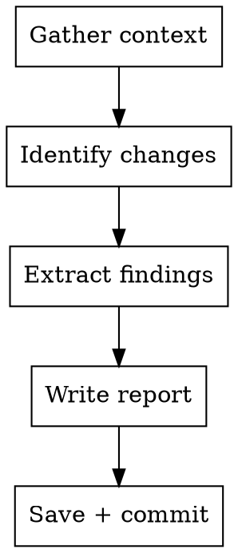

> **Execution model:** This skill runs on the Orchestrator seat during the ship phase. No subagent dispatch needed. All operations are direct file reads and markdown generation.

# REPORT — Project Manager Post-Ticket Report

## Overview

Generate a concise project status document after completing a ticket. The report captures what changed, why it matters for the system's behavior, and key findings discovered during implementation.

This kit ships no post-deploy verification gate, so this skill has no pre-flight
checks of its own — it goes straight to gathering context. If your project needs
a gate that verifies a change actually reached a separately-deployed environment
before reporting on it, that is a domain-specific extension; see
`excluded/README.md`'s write-your-own-gate example.

## When to Use

- **T3 Critical pipeline — final step:** Required after shipping high-stakes logic changes, schema migrations, or core business-logic changes
- After completing an analysis that produced findings (e.g., a multi-agent debate session — module `31-debate-tools`, if installed)
- When the user asks for a project status update
- **Skip for T1 and T2 work** — the commit message is sufficient for micro fixes and standard features

## Process



### 1. Gather Context

Run these commands (read-only, no confirmation needed):

```bash
# What ticket/branch was just completed
git log --oneline -10

# What files changed
git diff main~N..main --stat  # where N = number of new commits

# Current test status
{{TEST_CMD}} 2>&1 | tail -5
```

If this project has a central config file, skim its current values — they're
useful context for the "Configuration Impact" section below.

Read relevant files:
- The ticket body (via this project's ticketing system — `gh issue view <number>` for the GitHub-issues variant of module `25-ticketing`, or the local ticket file for its local-tickets variant)
- The spec if one exists (`docs/superpowers/specs/`)
- Any generated reports (wherever this project keeps generated analysis/results artifacts)
- Memory files for session context, if this project keeps them

### 2. Identify Changes

For each file changed, categorize:
- **System functionality** — new capabilities, changed behavior
- **Analysis/calibration** — new insights, parameter recommendations
- **Infrastructure** — deployment, monitoring, testing improvements
- **Config** — parameter changes, thresholds, feature flags

### 3. Extract Key Findings

Look for:
- Surprising results (expected X, got Y)
- Bugs caught during audit/review
- Data insights (success/error rates, error distributions, per-segment patterns)
- Decisions made and why (chose A over B because...)
- Open questions for future work

### 4. Write Report

Save to: `docs/project-updates/YYYY-MM-DD-<ticket-id>.md`

## Report Template

```markdown
# Project Update: <TICKET-ID> — <Title>

**Date:** YYYY-MM-DD
**Branch:** feature/<branch-name>
**Ship reference:** PR #<number> (github ship variant) / commit <sha> (local ship variant) — whichever this install uses
**Status:** Merged / In Progress / Analysis Complete

---

## What Changed

<1-3 sentences: what was built or analyzed, in plain language>

### Files Modified
- `path/to/file.py` — <what changed and why>

### New Capabilities
- <What the system can now do that it couldn't before>
- <Or: what we now know that we didn't before>

---

## Key Findings

<The most important things discovered during this work>

### <Finding 1 title>
<Concise explanation with numbers. What does this mean for the system?>

### <Finding 2 title>
...

---

## Configuration Impact

| Parameter | Before | After | Reason |
|-----------|--------|-------|--------|
| <param> | <old> | <new> | <why> |

*Or: "No config changes — analysis only (advisory)"*

---

## Current Project Status

<Adjust rows to whatever operational metrics matter for this project — the
example rows below are illustrative, not a fixed schema.>

| Metric | Value |
|--------|-------|
| Open items | <N> |
| Completed items | <N> |
| Schema version (if applicable) | <N> |
| <this project's own key metric> | <value> |

---

## What's Next

- <Immediate next ticket or action>
- <What this work unblocks>
- <Open questions to revisit later>
```

## Writing Style

Per this project's CLAUDE.md writing-style conventions (if it documents one):
write for a technically sharp reader who is not necessarily a specialist in this
project's domain.
- Define domain-specific terms on first use
- Use concrete numbers, not vague qualifiers
- Explain WHY, not just WHAT
- If a finding is surprising, say so and explain what was expected

## Quick Reference

| Section | Focus |
|---------|-------|
| What Changed | Facts — files, capabilities, behavior |
| Key Findings | Insights — surprises, data, decisions |
| Config Impact | Parameters — before/after with reasons |
| Project Status | Snapshot — current operational state |
| What's Next | Direction — unblocked work, open questions |
