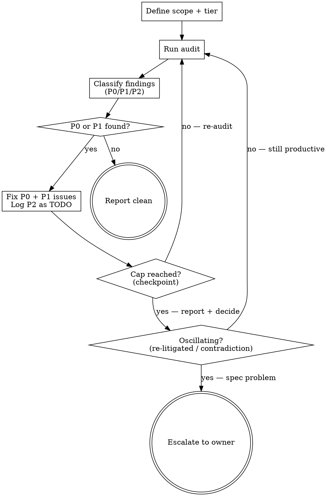

> **Kit variant: FULL profile.** Installed when this project's rigor manifest
> resolves to FULL (`audit_variant: full`). Runs the complete round-capped
> iterative loop, the spec→code surface diff, and the leanness/duplication
> checks. The STANDARD-profile counterpart (`audit_variant: lite`, a single-pass
> review with none of that) is a separate variant of this same skill — only one
> is ever installed under the name `REVIEW`.

# REVIEW — Severity-Gated Review Loop

## Overview

Run an audit cycle on the specified scope (code, spec, plan, data). Findings are classified by severity (P0/P1/P2). Fix blockers and majors, re-audit, repeat until P0 = 0 and P1 = 0. P2 findings ship as tracked TODOs. Rounds are bounded by tier.

## Seat Routing

This skill uses the seat table from the active routing profile (`profiles/routing-*.md`) — never a hardcoded model name.

- **Retrieval seat**: linter/formatter/type-checker invocation, TODO debt scan, tier re-classification scan, schema validation
- **Workers seat**: T1 safety-gate judgment, P0/P1/P2 severity classification, non-high-stakes P0/P1 fixes, final report
- **Audit reviewer seat** (finding generation, always — this is the seat's defining job across every routing profile): dispatch it fresh-context, no main-conversation pollution. Also used for fixes where `is_high_stakes_logic == true` OR `propagation_path_uncertain == true` OR the file matches `RISK_PREFIXES` OR the round is in the final 2 rounds of a T3 cap (round-number escalation — subtle cross-file reasoning benefits from the stronger seat)

**3-step escalation on schema-shape validation failure:**
1. Re-prompt the same seat with the shape error
2. Escalate one seat tier (Retrieval→Workers, Workers→Audit reviewer) and re-prompt
3. Halt and report to the orchestrator

## When to Use

- **T1 Micro:** Not invoked directly. T1 uses the automated T1 safety gate (see below) instead of a full audit loop.
- **T2 Standard / T3 Critical:** After completing implementation — severity-gated review loop.
- After completing a fix pass — verify no new issues
- When a code review, spec review, or plan review finds bugs
- When the user explicitly requests `/REVIEW`

## T1 Safety Gate

T1 changes don't use the full audit loop. Instead, an automated safety gate runs before Definition of Done checks. This catches tier misclassification — the #1 risk for T1 work.

**Checks (automated, ~10 seconds):**

1. **Risk-path scan** — Do any changed files match this install's `RISK_PREFIXES` (module `20-tier-system`)?
2. **Logic-change scan** — Does the diff contain added/modified conditionals, return values, function signatures, numeric constants, comparison operators, or boolean logic?
3. **Size check** — Are there more than 5 non-comment, non-whitespace changed lines?

**If any check triggers:** Auto-escalate to T2. Tell the owner: "T1 safety gate failed — [reason]. Upgrading to T2." Then follow the T2 pipeline from the start.

**If all checks pass:** Proceed with Definition of Done (this project's test/lint/format/type commands — `{{TEST_CMD}}` / `{{LINT_CMD}}` / `{{TYPE_CMD}}`, from the CLAUDE.md skeleton) → commit → ship.

**Seat:** Dispatch safety gate checks via the Workers seat. Gate output feeds a commit decision — that needs judgment beyond the Retrieval seat's mechanical lookups.

## Severity Model

| Severity | Definition | Blocks merge? | Example |
|----------|-----------|---------------|---------|
| **P0 — Blocker** | Logic error, security vulnerability, data corruption risk, a regression in core/high-stakes behavior, CLAUDE.md hard-rule violation | Yes — must fix and re-audit | Off-by-one in a core calculation, SQL injection, missing auth check |
| **P1 — Major** | Incorrect behavior with contained/non-critical impact, missing test coverage for critical path, spec deviation | Yes — must fix, re-audit only the fix | Wrong return type, untested edge case, missing validation |
| **P2 — Minor** | Style inconsistency, suboptimal naming, missing docstring, minor refactor opportunity | No — track as `# TODO` | Variable naming, import order, comment clarity |

## Exit Criteria

- **Pass:** Zero P0 + Zero P1 findings
- **Ship with TODOs:** Zero P0, P1s fixed, P2s tracked as `# TODO` comments
- **Round cap (checkpoint, not a hard stop):** T2 (and T2-RISK) = 3 rounds, T3 (and T3-RISK) = 5 rounds. The cap is a **checkpoint cadence** — at the cap, report the current finding set and decide: terminate on **zero new findings**, or continue if the round is still productively surfacing new findings, or escalate on **oscillation**.
- **Oscillation** (the only escalation trigger; oscillation definition verbatim from `MAP/SKILL.md`, with REVIEW-domain parenthetical: "node" = finding, "verifier" = reviewer): *the round re-litigated an already-explored node (finding) with no new evidence, OR two verifiers (reviewers) contradict on the same node (finding) across ≥2 rounds with no new evidence resolving it, OR the map (finding set) neither grew nor resolved.* On oscillation, escalate to the owner — the spec likely needs revision, not more rounds.

## Process



## Steps

### 1. Define Scope and Tier

Determine what is being audited and the round limit:
- **Code audit:** specific files, a module, or all changed files in a branch
- **Spec/plan review:** a design doc or plan file
- **Data audit:** analysis results, config values, parameter derivations

Round limit comes from the tier (a `-RISK` suffix uses its base tier's cap):
- **T2 / T2-RISK:** max 3 rounds
- **T3 / T3-RISK:** max 5 rounds

If the user didn't specify scope, infer from context (current ticket, recent changes, files just modified).

### 2. Run Review

Dispatch the Audit reviewer seat (fresh context, no main-conversation pollution).

**The reviewer must return findings as a JSON array** where each entry matches this shape:

~~~json
{
  "severity": "P0|P1|P2",
  "file": "path/to/file.py",
  "line": 42,
  "rule": "rule-name",
  "description": "What is wrong and why",
  "is_high_stakes_logic": true,
  "is_high_stakes_logic_justification": "Why this does/doesn't affect high-stakes logic",
  "propagation_path_uncertain": false
}
~~~

**After the reviewer returns, confirm the shape.** Every entry needs all seven fields, `severity` must be one of P0/P1/P2, and `line` must be an integer. A malformed or incomplete return is a validation failure — follow the 3-step escalation above.

**Mechanical sub-operations** use the Retrieval seat:
- Test/lint/format/type-check invocation and output parsing (`{{TEST_CMD}}` / `{{LINT_CMD}}` / `{{TYPE_CMD}}`)
- TODO debt scan (`grep -rn "# TODO" <this project's source + test roots>`)
- Tier re-classification scan (pattern-matching spec against T3 indicator keywords)

The reviewer also checks:

**Code audit checklist:**
- [ ] `{{TEST_CMD}}` — zero failures
- [ ] `{{LINT_CMD}}` — clean
- [ ] `{{TYPE_CMD}}` — zero errors
- [ ] Logic bugs, edge cases, regressions
- [ ] Security (injection, secrets, command injection)
- [ ] CLAUDE.md compliance (naming, error handling, and this stack's own conventions)
- [ ] Test coverage for new code
- [ ] **T3 only, if the debate-tools module (COUNCIL/DEBATE) was used for this ticket:** Research-traceability check — does implementation align with their consensus?

**Spec/plan review checklist:**
- [ ] Completeness — all requirements addressed
- [ ] Consistency — no contradictions between sections
- [ ] Feasibility — implementation steps are concrete
- [ ] Edge cases — boundary conditions considered

**Data audit checklist:**
- [ ] Source verification — every number traced to primary source
- [ ] Math verification — formulas checked with real values
- [ ] Assumption audit — all assumptions listed with evidence

### 2b. Spec→code surface diff

Verify every numbered AC has a corresponding implementation in the diff.

1. Locate the spec at `docs/superpowers/specs/<spec>.md` (most recent on the current branch, or the spec linked in the standing brief at `**Spec:**`).
2. Extract every line under `## Acceptance criteria` matching `- [ ] AC-N: <text>`. If zero matches, the spec is legacy-format and Step 2b is skipped.
3. Ensure `docs/superpowers/audits/` exists (`mkdir -p docs/superpowers/audits`).
4. Dispatch ONE Retrieval-seat subagent with: the AC list, `git diff main...HEAD --stat` summary, and full diff via `git diff main...HEAD`. It grep/AST-walks for evidence per AC and writes `docs/superpowers/audits/<branch-slug>-code-surface.md` with this format:

   ```
   AC-1 → src/foo.py:120-145 (function `bar` matches "...")
   AC-2 → tests/test_foo.py:42 (asserts new behavior)
   AC-3 → NO IMPLEMENTATION FOUND
   AC-4 → src/baz.py:80 (PARTIAL — described X, code only does Y)
   ```

   For artifact-existence ACs (e.g., "AC-N: file X exists with frontmatter Y"), the subagent uses Read+parse, not just grep.

5. Findings:
   - Any "NO IMPLEMENTATION FOUND" → automatic P1.
   - Any "PARTIAL" → automatic P1 unless the gap is documented in the spec's `## Out of scope` section.
   - **New-module deletion test:** for any diff that adds a new module (new source file or new top-level `class`), state the deletion-test answer (`docs/harness/26-code-discipline.md`, module `26-code-discipline`). A module whose deletion would merely move complexity across callers (pass-through/shallow) is **auto-P1** unless the spec's Out-of-scope documents why it must exist.
   - **Interface-design divergent shapes (P1):** if the diff adds a new public code interface (a new source file, or a new top-level `class`), the spec or plan MUST record that ≥2 divergent interface shapes were considered before one was chosen (this project's interface-design discipline — `docs/harness/26-code-discipline.md`, module `26-code-discipline`). Evidence is prose, not format-strict: a bulleted list of candidate signatures, a "Decisions made" note naming the rejected shape, or an ADR if this project keeps one. No such record → **P1** unless the spec's `## Out of scope` documents why. Distinct from the deletion-test bullet above (that asks "is the module a pass-through?"; this asks "were divergent shapes competed, or was the first silently anchored?").
   - Findings carry forward into Step 3 classification.

### 2b(ii). Effect-chain per finding — extends Step 2b with the runtime dimension

Step 2b (above) is a **static** surface diff (AC-coverage + deletion-test + divergent-shapes). For each P0/P1 finding it produced (and each P0/P1 from Step 2), the reviewer ALSO traces **one ring** of direct callers/consumers **inline** (grep/AST in the same reviewer pass — NOT a new per-finding subagent) and states the **blast radius**: which call-sites, readers, or downstream state the fix will touch. This adds the runtime effect-chain dimension that the static checks miss; it is the REVIEW-time, in-flow analogue of the MAP effect-chain (reserve a full MAP loop for high-blast / bug-investigation work). Cost ≈ +10%/round (the trace rides the reviewer round, which is already ~10-20k tokens). State the blast radius in the finding's Step-6 report line.

### 2b(iii). Diff-scoped hand-mirror / drift / duplication check + leanness baseline-bump guard

Step-2b's **New-module deletion test** bullet (under `### 2b`, the "for any diff that adds a new module..." bullet) fires only when the diff ADDS a module. Step-2b(iii) broadens that same duplication concern to hand-mirrored or drifted logic in EXISTING changed code, and adds the leanness-ratchet baseline guard. Both are diff-scoped — do NOT scan unchanged code.

(a) **Hand-mirror / drift / duplication (diff-scoped, unconditional).** For each changed hunk, check whether the logic re-implements or hand-mirrors an existing canonical implementation — the class of bug where a computation is quietly re-implemented in a second place and the two copies drift apart over time. When the hunk duplicates a shared computation, the finding message names `{{SHARED_CODE_HOME}}` — this project's designated shared-code home (an ADAPT token filled in per your layout; module 26's optional leanness-ratchet-template component, if installed, targets the same location) — as the remediation target: "extract to / reuse `{{SHARED_CODE_HOME}}` rather than hand-mirroring." Report as P1 (P2 if the duplication is trivial and local).

(b) **Leanness baseline-bump guard — conditional on module 26's optional ratchet-template component being installed AND ACTIVATED.** Module 26 ships this component inactive, as `tests/test_leanness_ratchet.py.template` + `tests/leanness_baseline.json.template` — a `.template` file is never a live baseline. This sub-check keys strictly on the ACTIVE, opted-in files (no `.template` suffix): if this repo has a live `tests/leanness_baseline.json` (the grandfathered set behind a live `tests/test_leanness_ratchet.py`) — i.e., an adopter has renamed the templates back and generated their own baseline — and the diff modifies it, inspect the change direction: any **GROWTH** — an added `[file, code, qualified_symbol, count]` row OR a raised count on an existing row — is a **P1** requiring an explicit justification line in the audit artifact (a genuinely new or more-complex violation was grandfathered rather than simplified). A pure **SHRINK** (removed row or lowered count — a fixed violation) is expected and needs no justification. If the live `tests/leanness_baseline.json` doesn't exist in this repo — whether because module 26 isn't installed, or its ratchet template is present only as the shipped, un-activated `.template` files — skip this sub-check cleanly; it has nothing to check.

### 3. Classify Findings

Every finding gets a severity:
- **P0 — Blocker:** Would cause data loss, security breach, a critical logic error, or a violation of this project's hard rules (CLAUDE.md)
- **P1 — Major:** Incorrect behavior or missing critical coverage, but bounded impact
- **P2 — Minor:** Style, naming, docs — no functional impact

### 4. Fix or Track

- **P2:** Add `# TODO` comment in the code. Do NOT fix during audit — these ship as-is.
- **P0 and P1 — check fix seat routing:**
  - If `is_high_stakes_logic == true` → fix using the Audit reviewer seat
  - If `propagation_path_uncertain == true` → fix using the Audit reviewer seat
  - If `file` matches this install's `RISK_PREFIXES` → fix using the Audit reviewer seat
  - If T3 (or T3-RISK) audit and current round is in the final 2 rounds of the cap → fix using the Audit reviewer seat (round-number escalation — subtle cross-file reasoning)
  - Otherwise → fix using the Workers seat
- Minimal change needed. Run tests after each fix.

### 4b. Re-Verify Gate (mandatory after P0/P1 fixes)

**This gate is a hard stop. Do not proceed to Step 5 without completing both steps.**

After applying P0/P1 fixes and confirming tests pass, a re-verify second-opinion-seat call is required before re-auditing. Applying a fix does not prove the fix is correct — a fix batch can look complete on read-through while missing an unrelated defect that only a second, independent look would catch.

1. Record gate evidence:
   ```bash
   python3 .claude/hooks/check_gate_evidence.py --write-evidence audit-fix
   ```

2. Dispatch the second-opinion seat — describe what was fixed and ask whether the fixes are correct.
   - If it confirms: proceed to Step 5.
   - If it identifies new issues: apply fixes, run tests, then repeat this gate (record evidence again, dispatch again).

**Skip condition:** If the only fix was a P2 tracked as `# TODO` (no P0/P1 code changes), skip this gate — P2 fixes don't require re-verify.

**Gate-evidence ownership (canonical):** `audit-fix` is recorded here (after P0/P1 fixes); `audit` is recorded by REVIEW on a clean Step-6 report (below) — REVIEW is the canonical `audit` writer on a normal ticket. MAP also records `audit` when MAP is the convergence engine (`MAP/SKILL.md` step 6). Both are idempotent; this project's ship gate accepts either.

### 5. Re-Review (if P0 or P1 were found)

Go back to Step 2 and run the **full audit again**. This includes dispatching a fresh Audit-reviewer-seat pass. Fixes can introduce new bugs — a clean re-audit proves they didn't.

Check the round count against the cap (checkpoint cadence, not a hard stop):
- **Zero new findings this round → clean; proceed to Step 6.**
- **Still productively surfacing new findings → continue** (the cap is a checkpoint; report progress, don't grind to a halt at the number).
- **Oscillation** (as defined above in Exit Criteria) **→ escalate.** Tell the owner: "Oscillating after N rounds — the spec or plan likely needs revision."

### 6. Report

**During audit (per cycle):**
```
## Review — Cycle <N>/<max>

**Scope:** <what was audited>
**Result:** P0: <n> | P1: <n> | P2: <n>

### P0 — Blockers
1. `file:line` — description → **Fixed:** what changed

### P1 — Major
1. `file:line` — description → **Fixed:** what changed

### P2 — Minor (tracked as TODO)
1. `file:line` — description → Added `# TODO`
```

**On a clean pass (P0 = 0 AND P1 = 0), REVIEW is the canonical writer of the `audit` gate evidence** — record it BEFORE emitting the clean report. This closes the clean-first-pass gate leak (a clean audit that never ran Step 4b previously recorded no evidence, so the ship check depended on a manual write). Idempotent with MAP-recorded `audit` evidence:

```bash
python3 .claude/hooks/check_gate_evidence.py --write-evidence audit
```

**Final report (clean pass):**
```
## Review Clean — <N> cycles

**Scope:** <what was audited>
**Rounds:** <N>/<max>
**Issues fixed:** P0: <n>, P1: <n>
**TODOs tracked:** P2: <n>

All checks pass: tests ✓ | lint ✓ | format ✓ | types ✓ | logic ✓ | security ✓
```

## P2 TODO Debt Management

P2 findings become `# TODO` comments. Without cleanup, these accumulate. The REVIEW skill tracks this.

**After each audit, include in the final report:**
```
**TODO debt:** <total TODOs in codebase> (<N> new this ticket)
**RISK_PREFIXES TODOs:** <per-prefix breakdown, if any>
```

**Debt ceilings:**
- **> 40 TODOs total:** Warn owner. Recommend cleanup session before new work.
- **> 3 TODOs in any single `RISK_PREFIXES` path:** Flag immediately.
- **Any TODO older than 90 days:** Flag as stale — upgrade to a ticket or delete.

**TODO cleanup is T1 work.** Fixing a P2 TODO is a micro fix by definition. Run through T1 pipeline.

## Tier Re-Classification Check

**When:** After brainstorm+spec approval, before proceeding to plan (T2 pipeline only).

**Automated scan:** Check the approved spec for T3 indicators:
- Schema changes, database migrations, new tables
- Core business-logic calculations, algorithm parameters, calibration/tuning logic
- Multi-system coordination, changes across 3+ modules
- New external API dependencies, data contract changes

**If indicators found:** Flag to owner: "T3 indicators detected in spec: [list]. Recommend upgrading to T3 pipeline. Continue T2 or upgrade?" Owner decides. Do not auto-escalate — the owner may have context that makes T2 appropriate despite the indicators.

## Tracking Front-Loading Effectiveness

After each audit, log to the commit message or a project-status report:
- **Audit rounds this ticket:** N
- **P0/P1 findings traceable to spec gaps:** N out of total

After 20+ tickets, review whether spec-phase rigor is actually preventing findings. Update the confidence labels in this project's own workflow notes with verified data.

## Rules

1. **Classify every finding.** No unclassified issues.
2. **Never fix P2 during audit.** Track as TODO and move on. P2 fixes waste tokens.
3. **Never skip re-audit after fixing P0/P1.** Fixes introduce new bugs.
4. **Round cap is a checkpoint, not a guillotine.** T2 = 3, T3 = 5. Terminate on zero new findings; escalate only on oscillation (as defined in Exit Criteria, per `MAP/SKILL.md`). Retain the Step-4b per-fix re-verify call regardless of round count.
5. **Stay in scope.** Don't fix unrelated code discovered during audit.
6. **Track cycle count.** Report "Cycle 2/3: P0: 0, P1: 1, P2: 2" every round.
7. **Escalate only on oscillation, not on reaching the cap.** If the cap is reached but the round is still surfacing new findings, continue. Escalate only on oscillation (as defined in Exit Criteria, per `MAP/SKILL.md`). "re-litigated" and "re-litigated with no new evidence" are the load-bearing terms from that definition.
8. **Report TODO debt.** Include total count and `RISK_PREFIXES` count in every final report.
9. **Flag stale TODOs.** Any TODO older than 90 days gets flagged for cleanup or deletion.
