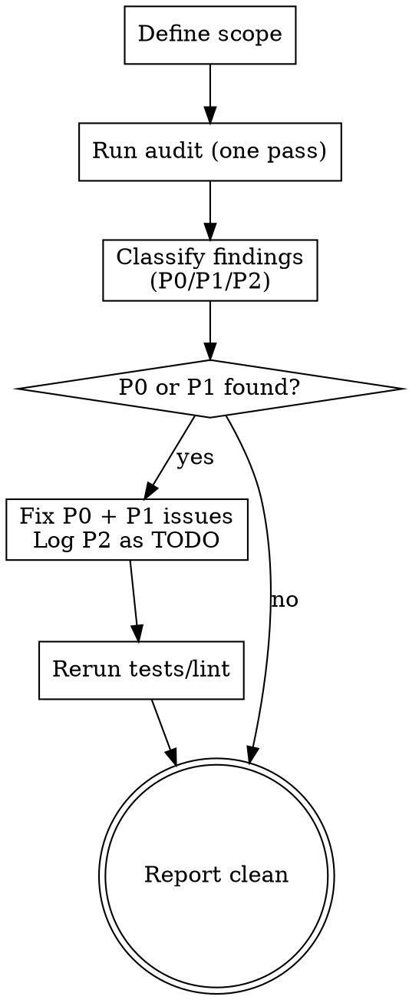

> **Kit variant: STANDARD profile.** Installed when this project's rigor manifest
> resolves to STANDARD (`audit_variant: lite`, `audit_rounds: 1`). Runs ONE review
> pass — no round-capped re-review loop, no spec→code surface diff, no
> leanness/duplication checks, no T3 tier (this profile's tier scope is T1/T2
> only). The FULL-profile counterpart (`audit_variant: full`) carries all of
> that; only one variant is ever installed under the name `REVIEW`.

# REVIEW — Single-Pass Severity-Gated Review

## Overview

Run one audit pass on the specified scope (code, spec, plan, data). Findings are classified by severity (P0/P1/P2). Fix blockers and majors; P2 findings ship as tracked TODOs. Unlike the FULL-profile variant, this variant does not re-dispatch the reviewer after fixes — apply the fix, rerun tests/lint, and report. That trades a second adversarial pass for speed, matching this rigor profile's "process weight a mechanical-automation or T1/T2-only project can't justify" design. If a fix feels risky enough that you want a second look, that is itself a signal this ticket may need the FULL-profile variant, not a reason to add an ad-hoc loop here.

## Seat Routing

This skill uses the seat table from the active routing profile (`profiles/routing-*.md`) — never a hardcoded model name.

- **Retrieval seat**: linter/formatter/type-checker invocation, TODO debt scan
- **Workers seat**: T1 safety-gate judgment, P0/P1/P2 severity classification, fixes, final report
- **Audit reviewer seat** (finding generation, always): dispatch it fresh-context, no main-conversation pollution

## When to Use

- **T1 Micro:** Not invoked directly. T1 uses the automated T1 safety gate (see below) instead of the audit pass.
- **T2 Standard:** After completing implementation — one severity-gated review pass.
- After completing a fix pass — verify no new issues
- When a code review, spec review, or plan review finds bugs
- When the user explicitly requests `/REVIEW`

## T1 Safety Gate

T1 changes don't use the audit pass. Instead, an automated safety gate runs before Definition of Done checks. This catches tier misclassification — the #1 risk for T1 work.

**Checks (automated, ~10 seconds):**

1. **Risk-path scan** — Do any changed files match this install's `RISK_PREFIXES` (module `20-tier-system`)?
2. **Logic-change scan** — Does the diff contain added/modified conditionals, return values, function signatures, numeric constants, comparison operators, or boolean logic?
3. **Size check** — Are there more than 5 non-comment, non-whitespace changed lines?

**If any check triggers:** Auto-escalate to T2. Tell the owner: "T1 safety gate failed — [reason]. Upgrading to T2." Then follow the T2 pipeline from the start.

**If all checks pass:** Proceed with Definition of Done (this project's test/lint/format/type commands — `{{TEST_CMD}}` / `{{LINT_CMD}}` / `{{TYPE_CMD}}`, from the CLAUDE.md skeleton) → commit → ship.

**Seat:** Dispatch safety gate checks via the Workers seat. Gate output feeds a commit decision — that needs judgment beyond the Retrieval seat's mechanical lookups.

## Severity Model

| Severity | Definition | Blocks merge? | Example |
|----------|-----------|---------------|---------|
| **P0 — Blocker** | Logic error, security vulnerability, data corruption risk, a regression in core/high-stakes behavior, CLAUDE.md hard-rule violation | Yes — must fix | Off-by-one in a core calculation, SQL injection, missing auth check |
| **P1 — Major** | Incorrect behavior with contained/non-critical impact, missing test coverage for critical path, spec deviation | Yes — must fix | Wrong return type, untested edge case, missing validation |
| **P2 — Minor** | Style inconsistency, suboptimal naming, missing docstring, minor refactor opportunity | No — track as `# TODO` | Variable naming, import order, comment clarity |

## Exit Criteria

- **Pass:** Zero P0 + Zero P1 findings after this pass's fixes.
- **Ship with TODOs:** Zero P0, P1s fixed, P2s tracked as `# TODO` comments.
- **No round cap.** This profile runs exactly ONE reviewer dispatch per audit invocation. If a fix reveals a deeper problem the single pass can't resolve, escalate to the owner rather than looping.

## Process



## Steps

### 1. Define Scope

Determine what is being audited:
- **Code audit:** specific files, a module, or all changed files in a branch
- **Spec/plan review:** a design doc or plan file
- **Data audit:** analysis results, config values, parameter derivations

If the user didn't specify scope, infer from context (current ticket, recent changes, files just modified).

### 2. Run Review

Dispatch the Audit reviewer seat (fresh context, no main-conversation pollution).

**The reviewer must return findings as a JSON array** where each entry matches this shape:

~~~json
{
  "severity": "P0|P1|P2",
  "file": "path/to/file.py",
  "line": 42,
  "rule": "rule-name",
  "description": "What is wrong and why"
}
~~~

**Mechanical sub-operations** use the Retrieval seat:
- Test/lint/format/type-check invocation and output parsing (`{{TEST_CMD}}` / `{{LINT_CMD}}` / `{{TYPE_CMD}}`)
- TODO debt scan (`grep -rn "# TODO" <this project's source + test roots>`)

The reviewer also checks:

**Code audit checklist:**
- [ ] `{{TEST_CMD}}` — zero failures
- [ ] `{{LINT_CMD}}` — clean
- [ ] `{{TYPE_CMD}}` — zero errors
- [ ] Logic bugs, edge cases, regressions
- [ ] Security (injection, secrets, command injection)
- [ ] CLAUDE.md compliance (naming, error handling, and this stack's own conventions)
- [ ] Test coverage for new code

**Spec/plan review checklist:**
- [ ] Completeness — all requirements addressed
- [ ] Consistency — no contradictions between sections
- [ ] Feasibility — implementation steps are concrete
- [ ] Edge cases — boundary conditions considered

**Data audit checklist:**
- [ ] Source verification — every number traced to primary source
- [ ] Math verification — formulas checked with real values
- [ ] Assumption audit — all assumptions listed with evidence

### 3. Classify Findings

Every finding gets a severity:
- **P0 — Blocker:** Would cause data loss, security breach, a critical logic error, or a violation of this project's hard rules (CLAUDE.md)
- **P1 — Major:** Incorrect behavior or missing critical coverage, but bounded impact
- **P2 — Minor:** Style, naming, docs — no functional impact

### 4. Fix or Track

- **P2:** Add `# TODO` comment in the code. Do NOT fix during audit — these ship as-is.
- **P0 and P1:** Fix using the Workers seat. Minimal change needed. Run tests after each fix.
- No re-dispatch of the reviewer after fixing — this profile's single-pass design (see Overview).

### 5. Report

**On a clean pass (P0 = 0 AND P1 = 0), REVIEW is the canonical writer of the `audit` gate evidence** — record it BEFORE emitting the clean report:

```bash
python3 .claude/hooks/check_gate_evidence.py --write-evidence audit
```

**Report:**
```
## Review — <clean | fixed>

**Scope:** <what was audited>
**Result:** P0: <n> | P1: <n> | P2: <n>

### P0 — Blockers
1. `file:line` — description → **Fixed:** what changed

### P1 — Major
1. `file:line` — description → **Fixed:** what changed

### P2 — Minor (tracked as TODO)
1. `file:line` — description → Added `# TODO`

All checks pass: tests ✓ | lint ✓ | format ✓ | types ✓ | logic ✓ | security ✓
```

## P2 TODO Debt Management

P2 findings become `# TODO` comments. Without cleanup, these accumulate. The REVIEW skill tracks this.

**After each audit, include in the final report:**
```
**TODO debt:** <total TODOs in codebase> (<N> new this ticket)
**RISK_PREFIXES TODOs:** <per-prefix breakdown, if any>
```

**Debt ceilings:**
- **> 40 TODOs total:** Warn owner. Recommend cleanup session before new work.
- **> 3 TODOs in any single `RISK_PREFIXES` path:** Flag immediately.
- **Any TODO older than 90 days:** Flag as stale — upgrade to a ticket or delete.

**TODO cleanup is T1 work.** Fixing a P2 TODO is a micro fix by definition. Run through T1 pipeline.

## Rules

1. **Classify every finding.** No unclassified issues.
2. **Never fix P2 during audit.** Track as TODO and move on. P2 fixes waste tokens.
3. **Stay in scope.** Don't fix unrelated code discovered during audit.
4. **Report TODO debt.** Include total count and `RISK_PREFIXES` count in every final report.
5. **Flag stale TODOs.** Any TODO older than 90 days gets flagged for cleanup or deletion.
6. **No T3 at this profile.** This install's tier scope is T1/T2 only (module `20-tier-system`'s `tier_scope: LITE`) — there is no tier-reclassification check here because there is no higher tier to reclassify into.
